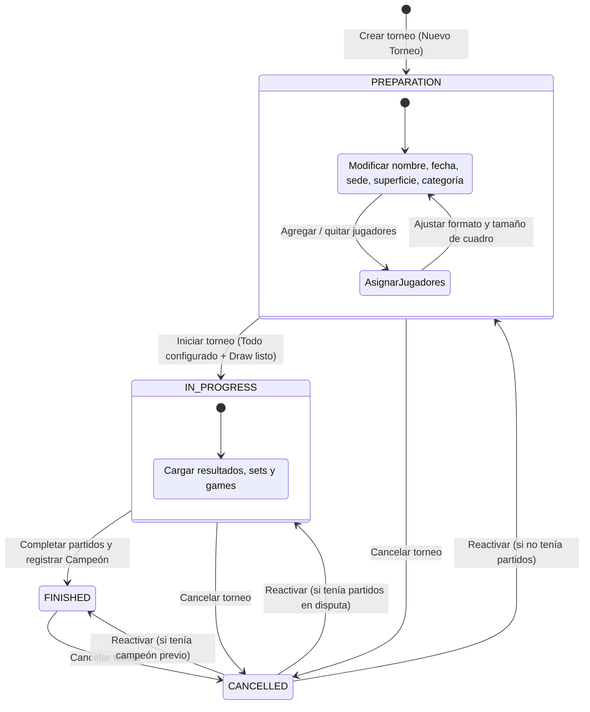

# Ciclo de Vida y Estados de un Torneo (Westfold Tennis)

Este documento describe la especificación funcional y técnica del ciclo de vida de los torneos en **Westfold Tennis**, estableciendo las transiciones, permisos y reglas de negocio para cada uno de sus 4 estados posibles.

---

## 1. Resumen de Estados

| Estado | Clave Enum | Descripción | Acciones Permitidas | Impacto en Puntos |
| :--- | :--- | :--- | :--- | :--- |
| **En preparación** | `PREPARATION` | Torneo recién creado o en fase de armado previo al inicio. | Modificar formato, sede, superficie, tamaño de cuadro, clasificados, categoría, nombre y gestionar libremente los jugadores participantes. | No otorga puntos (aún no se disputa). |
| **En curso** | `IN_PROGRESS` | Competencia activa con cuadro/fixture generado. | Cargar partidos, registrar resultados y sets. No se permite alterar participantes ni formato. | No otorga puntos hasta completarse. |
| **Terminado** | `FINISHED` | Torneo finalizado tras completarse todos los partidos del cuadro. | Asignar o confirmar campeón del torneo. Registro de fecha de cierre (`finishedAt`). | **Otorga puntos oficiales** para el Leaderboard/Ranking según la categoría. |
| **Cancelado** | `CANCELLED` | Torneo suspendido o cancelado administrativamente. | Puede cancelarse desde cualquier estado. Se puede reactivar. | **0 puntos** otorgados para el ranking. Los partidos disputados **sí cuentan** para el Head-to-Head (H2H) y estadísticas de jugadores. |

---

## 2. Detalle de Cada Estado

### Estado 1: EN PREPARACIÓN (`PREPARATION`)
* **Momento de activación**: Se asigna automáticamente al momento de crear cualquier torneo nuevo (`status = PREPARATION`).
* **Objetivo**: Permitir al administrador configurar todos los aspectos deportivos y logísticos antes de dar inicio a la competencia.
* **Operaciones habilitadas**:
  - **Jugadores participantes**: Agregar o quitar jugadores confirmados (`players`). Se puede consultar en tiempo real el cupo ocupado respecto al tamaño del cuadro (`drawSize`).
  - **Formato del torneo**: Definir y cambiar el tipo de torneo (`Playoffs`, `Round Robin`, `Round Robin + Playoffs`).
  - **Tamaño del cuadro**: Configurar el `drawSize` (ej. 4, 8, 16, 32).
  - **Clasificados**: Configurar la cantidad de clasificados a playoffs (`qualifiers`) si el tipo es `Round Robin + Playoffs`.
  - **Configuración logística**: Modificar el nombre del torneo, la fecha programada, la sede deportiva (`venueId`), el tipo de superficie (`surfaceId`) y la categoría de puntos (`tournamentCategoryId`).
* **Restricciones**: No se pueden jugar ni cargar partidos oficiales mientras el torneo esté en preparación.

---

### Estado 2: EN CURSO (`IN_PROGRESS`)
* **Momento de activación**: Cuando el administrador confirma que el torneo está listo para iniciar (`action: 'start'`).
* **Requisitos para la transición**:
  1. Todos los parámetros de configuración obligatorios deben estar elegidos:
     - Nombre del torneo
     - Sede (`venueId`)
     - Superficie (`surfaceId`)
     - Categoría (`tournamentCategoryId`)
     - Formato / Tipo de torneo (`tournamentTypeId`)
     - Tamaño del cuadro (`drawSize` $\ge 2$)
  2. Cuadro y participantes listos:
     - Se debe contar con al menos 2 jugadores confirmados.
     - La cantidad de jugadores confirmados no puede exceder el `drawSize`.
     - El cuadro (draw) puede ser generado y visualizado por los participantes.
* **Operaciones habilitadas**:
  - Carga y actualización de partidos disputados con sus respectivos sets, games y tiebreaks.
  - Consulta en tiempo real del avance del bracket o tabla de posiciones de round robin.
* **Restricciones**: Queda bloqueada la modificación del formato, superficie, categoría y la adición/eliminación de jugadores para preservar la integridad del cuadro.

---

### Estado 3: TERMINADO (`FINISHED`)
* **Momento de activación**: Cuando se han jugado todos los partidos correspondientes al cuadro (la final en eliminación directa o todas las rondas en round robin) y se corona al ganador del torneo.
* **Requisitos para la transición**:
  1. Se debe seleccionar y registrar obligatoriamente al **Campeón** (`championId`) del torneo, elegido entre los participantes.
  2. Se registra automáticamente la fecha de finalización (`finishedAt = new Date()`).
* **Impacto en el sistema**:
  - El torneo pasa a computar formalmente para el **Leaderboard / Ranking anual y de los últimos 12 meses**.
  - Otorga los puntos correspondientes a la categoría (`TournamentCategoryPoints`) al campeón y finalistas según la escala configurada.
  - El título ganado incrementa el contador de torneos y campeonatos del jugador en su perfil público.

---

### Estado 4: CANCELADO (`CANCELLED`)
* **Momento de activación**: Puede ser cancelado en cualquier momento mediante la acción `Cancelar` en la consola de administración.
* **Reglas de Puntos vs Estadísticas H2H**:
  - **Puntos de Ranking**: **NO otorga puntos**. Los torneos con estado `CANCELLED` son expresamente ignorados en el cálculo del Leaderboard (`/api/leaderboard`).
  - **Historial H2H y Rendimiento Individual**: Si durante el torneo se alcanzaron a disputar partidos (completos o parciales), **estos partidos sí se conservan** y se contabilizan para:
    - El historial de enfrentamientos directos entre jugadores (`Head-to-Head` / H2H).
    - El balance total de victorias y derrotas de los jugadores.
    - La efectividad por superficie y estadísticas de sets/games.
* **Reactivación**: El administrador puede revertir la cancelación mediante la acción `Reactivar`, retornando al estado que corresponda (`PREPARATION`, `IN_PROGRESS` o `FINISHED`).

---

## 3. Diagrama de Transición de Estados

---

## 4. Matriz de Permisos de Edición

> [!IMPORTANT]
> **Congelamiento de Torneos Terminados**: Una vez que un torneo pasa al estado `TERMINADO` (`FINISHED`), queda completamente cerrado y **no puede ser editado** (ni en datos generales, ni en formato, ni en campeón o participantes) para garantizar la inmutabilidad de los resultados y del ranking oficial.

| Campo / Operación | PREPARATION | IN_PROGRESS | FINISHED | CANCELLED |
| :--- | :---: | :---: | :---: | :---: |
| Nombre del torneo | ✅ Sí | ⚠️ Solo admin | ❌ Bloqueado | ❌ No |
| Fecha | ✅ Sí | ⚠️ Solo admin | ❌ Bloqueado | ❌ No |
| Sede y Superficie | ✅ Sí | ❌ Bloqueado | ❌ Bloqueado | ❌ No |
| Categoría de puntos | ✅ Sí | ❌ Bloqueado | ❌ Bloqueado | ❌ No |
| Formato (`TournamentType`) | ✅ Sí | ❌ Bloqueado | ❌ Bloqueado | ❌ No |
| Tamaño de cuadro (`drawSize`) | ✅ Sí | ❌ Bloqueado | ❌ Bloqueado | ❌ No |
| Agregar / Quitar Jugadores | ✅ Sí (Gestor ágil) | ❌ Bloqueado | ❌ Bloqueado | ❌ No |
| Cargar Partidos y Sets | ❌ No | ✅ Sí | ❌ Bloqueado | ❌ No |
| Asignar Campeón | ❌ No | ✅ Al finalizar | ❌ Bloqueado | ❌ No |
| Botón "Editar" en Dashboard | ✅ Abre Modal | ✅ Formulario | ❌ Oculto / Bloqueado | ❌ No |
| Otorga Puntos de Ranking | ❌ No | ❌ No | ✅ Sí | ❌ No |
| Computa para Historial H2H | N/A | ✅ Sí | ✅ Sí | ✅ Sí |

